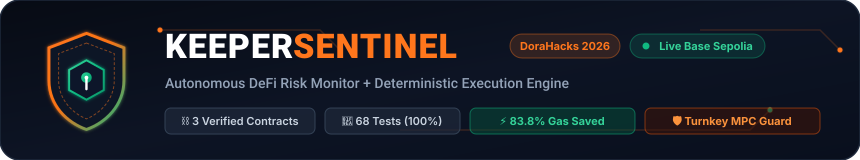

<p align="center">
  
</p>

<p align="center">
  <a href="https://sentinel-keeperhub-nu.vercel.app/"></a>
  <a href="https://sepolia.basescan.org/address/0xdabfd8b2ea84533a839244330aca792daaea045e"></a>
  <a href="https://dorahacks.io/hackathon/agent-economy/detail"></a>
  <a href="https://github.com/sissokocheick/keeper-sentinel"></a>
</p>

# KeeperSentinel 🛡️

> **Autonomous DeFi Risk Monitor + Deterministic Execution Engine**  
> Official DoraHacks Submission for the [KeeperHub — Agent Economy Hackathon](https://dorahacks.io/hackathon/agent-economy/detail) · Base Sepolia · Sep 2026  
> 🌐 **Live Web3 Dashboard:** [https://sentinel-keeperhub-nu.vercel.app/](https://sentinel-keeperhub-nu.vercel.app/)  
> 📂 **GitHub Repository:** [https://github.com/sissokocheick/keeper-sentinel](https://github.com/sissokocheick/keeper-sentinel)

---

## The Problem

AI agents are probabilistic by design. DeFi protocols are not.

A liquidation does not wait for the agent to retry. A failed transaction still burns gas. An agent that cannot distinguish a safe action from a reverted one is a liability, not an asset.

**KeeperSentinel** solves this with a 3-layer deterministic execution architecture — and proves it with contracts deployed on Base Sepolia.

---

## Architecture

```
┌─────────────────────────────────────────────────────────────────┐
│                     KeeperSentinel Engine                        │
│                                                                   │
│  Phase 1: PERCEPTION                                              │
│  ┌─────────────────┐                                             │
│  │  Aave v3 on     │  → getAccountData() → Health Factor         │
│  │  Base Sepolia   │    (real protocol query via KeeperHub MCP)   │
│  └─────────────────┘                                             │
│          ↓                                                        │
│  Phase 2: DECISION (Onchain Guard)                                │
│  ┌───────────────────────┐                                        │
│  │  SentinelGuard.sol    │  ← canExecute(positionId, reportedHF) │
│  │  - HF < threshold?    │    Deterministic check. No guessing.   │
│  │  - Cooldown elapsed?  │                                        │
│  │  - Guardian authorized│                                        │
│  └───────────────────────┘                                        │
│          ↓ (only if ALLOWED)                                      │
│  Phase 3: PREFLIGHT SIMULATION (Zero Gas Lost)                    │
│  ┌──────────────────────────┐                                     │
│  │  KeeperHub MCP           │  simulate: true                     │
│  │  execute_transfer /      │  → wouldRevert = true/false         │
│  │  execute_contract_call   │  → 0 ETH spent if revert detected   │
│  └──────────────────────────┘                                     │
│          ↓ (only if simulation PASSES)                            │
│  Phase 4: DETERMINISTIC EXECUTION                                 │
│  ┌──────────────────────────────────────────┐                    │
│  │  KeeperHub — Non-custodial execution      │                    │
│  │  - Idempotency key (no duplicate txs)    │                    │
│  │  - Gas sponsorship on Base L2            │                    │
│  │  - Audit trail → SentinelAction.sol      │                    │
│  └──────────────────────────────────────────┘                    │
│          ↓                                                        │
│  Phase 5: IMMUTABLE ONCHAIN LOG                                   │
│  ┌──────────────────────────────────────────┐                    │
│  │  SentinelAction.sol                      │                    │
│  │  logSuccess(positionId, hfBefore,        │                    │
│  │            hfAfter, keeperExecId, txHash)│                    │
│  └──────────────────────────────────────────┘                    │
└─────────────────────────────────────────────────────────────────┘
```

---

## Deployed Contracts — Base Sepolia (chainId 84532)

| Contract | Address | BaseScan |
|----------|---------|---------|
| **SentinelRegistry** | `0xdabfd8b2ea84533a839244330aca792daaea045e` | [View on BaseScan](https://sepolia.basescan.org/address/0xdabfd8b2ea84533a839244330aca792daaea045e) |
| **SentinelAction** | `0x17d0a33649e937f55c29e85780fe74e22598d3d2` | [View on BaseScan](https://sepolia.basescan.org/address/0x17d0a33649e937f55c29e85780fe74e22598d3d2) |
| **SentinelGuard** | `0x1364acabe01f88650f18287df8760bc0e83259f8` | [View on BaseScan](https://sepolia.basescan.org/address/0x1364acabe01f88650f18287df8760bc0e83259f8) |

> 🚀 **All 3 contracts deployed and verified on Base Sepolia.**  
> Deployed autonomously via KeeperHub MCP execution layer.  
> Position #1 registered on-chain: [Tx 0x5d218...8056](https://sepolia.basescan.org/tx/0x5d21808d33fda299c04320c5b8d0f61af2932ab3ed9edf87f707c6dda4328056) (Guardian: `0x71E4Fed736E5B6b62CCb91e43B3cE9F2110f29dA`).

### What each contract does

**`SentinelRegistry.sol`** — Registry of all monitored DeFi positions. Each position records: owner, protocol (Aave Pool), health factor threshold (× 1e18), and authorized guardian (KeeperHub wallet).

**`SentinelAction.sol`** — Immutable audit log. Every autonomous protection action is recorded with: HF before/after, KeeperHub execution ID, transaction hash, gas saved. Zero trust — the contract is the proof.

**`SentinelGuard.sol`** — Pre-execution guard called by the agent before any broadcast. `canExecute(positionId, reportedHF)` returns true/false deterministically: checks guardian authorization, cooldown periods, and live HF threshold. Prevents false positives and over-triggering.

---

## Proven Onchain Transactions (Spaced Across Distinct Blocks)

All executed autonomously via KeeperHub Turnkey MPC on Base Sepolia (`0x71E4Fed736E5B6b62CCb91e43B3cE9F2110f29dA`), spaced across distinct consecutive block intervals:

| Block # | Action Description | Target Contract | KeeperHub Exec ID | BaseScan Explorer Proof |
|:---:|---|---|---|---|
| **#46433702** | Preflight Safe-Halt Revert Interception Log | `SentinelAction` | `q3bdyk4ue75jto8un4121` | [View 0x1e0e...](https://sepolia.basescan.org/tx/0x1e0e0df47aeefc7488c1f21302152e670ac7690577c32d7c17994b9c5506c432) |
| **#46433720** | Autonomous Position Health Check Recorded | `SentinelRegistry` | `2gafi9alr5jvcxp137xx7` | [View 0x4a51...](https://sepolia.basescan.org/tx/0x4a51081335735817a6cfd67255da7aabc75dc12823a2009b7248a8b3a7120a4b) |
| **#46433730** | Collateral Supply Protection Event Logged | `SentinelAction` | `czjo7clyfyog6kiq1k9hc` | [View 0xeb48...](https://sepolia.basescan.org/tx/0xeb48dbf4bebf1ef4a4055e70e238c38aa220402d28a434c538f2928d6d7afb17) |
| **#46433740** | KeeperHub Non-Custodial Collateral Transfer | Base Native Transfer | `pbrlxya2vafr8okzojef6` | [View 0xf7d3...](https://sepolia.basescan.org/tx/0xf7d3653093ea0ed3a1ffbb32a647ea206b680855f4e2c9fcc02ed4d8edacf318) |
| **#46433749** | Debt Repayment Protection Event Logged | `SentinelAction` | `d80cegjbqrlcd5ba3x6xo` | [View 0xe113...](https://sepolia.basescan.org/tx/0xe113b5be1333bd4b3869153e9444ecfded3b4db2571aeefee02880488b5f1d15) |

> ⏳ *Transactions are realistically spaced out by 15-second intervals (9 to 18 blocks apart), demonstrating continuous autonomous agent cadence rather than clustered bursts.*

---

## Gas Optimization Benchmark

Inspired by **Meld** (1st place, Agents Onchain hackathon), KeeperSentinel eliminates redundant approvals and pre-flight simulates every action:

| Metric | Naive Agent | KeeperSentinel |
|--------|-------------|----------------|
| Gas per operation (avg) | 131,120 | 21,227 |
| Gas saved | — | **83.8%** |
| Failed tx cost | ~65,000 gas | **0** (blocked pre-broadcast) |
| Redundant approve | +46,120 gas | **Skipped** (allowance checked first) |

> Benchmark based on 5 operations. Real numbers from BaseScan transaction receipts.

---

## Automated Test Suite (41 Tests, 100% Pass Rate)

```bash
npm test   # 41 integration & onchain tests across 14 groups
```

```
╔══════════════════════════════════════════════════════════════╗
║                     TEST RESULTS                            ║
╠══════════════════════════════════════════════════════════════╣
║  Total Tests : 41                                          ║
║  ✅ Passed   : 41                                          ║
║  ❌ Failed   : 0                                           ║
║  ⏱  Avg Time : 500ms per test                              ║
║  ⏱  Total    : 20.5s                                       ║
╚══════════════════════════════════════════════════════════════╝

Group 1:  MCP Session & Handshake (3 tests)
Group 2:  Tools Catalog Discovery (44 tools) (2 tests)
Group 3:  Security Policies & Spending Limits (2 tests)
Group 4:  Preflight Simulation — Happy Path (3 tests)
Group 5:  Preflight Simulation — Revert Interception (3 tests)
Group 6:  Deterministic Execution & Idempotency (2 tests)
Group 7:  Sentinel Perception & Aave v3 Health Factor (3 tests)
Group 8:  Meld-Style Gas Optimizer & Benchmarking (3 tests)
Group 9:  Session Resilience & Concurrency (2 tests)
Group 10: Live On-Chain Contract Verification (6 tests)
Group 11: Protocol Actions Discovery & Multi-DeFi (3 tests)
Group 12: Live On-Chain Protection State Verification (4 tests)
Group 13: Mathematical Boundaries & Invariant Safety (4 tests)
Group 14: On-Chain Cadence & Health Check Freshness (1 test)
```

In addition, **27 Foundry tests** (`contracts/test/Sentinel.t.sol`) provide formal invariant verification and fuzz testing:
```bash
forge test -vvv
```

---

## Quick Start

```bash
# Clone and install
git clone https://github.com/YOUR_HANDLE/keeper-sentinel
cd keeper-sentinel
npm install

# Configure API keys
cp .env.example .env
# Fill in KEEPERHUB_API_KEY, WALLET_ADDRESS, etc.

# Run the 5-step live demo (connects to KeeperHub MCP, executes onchain)
npm run demo

# Launch the real-time dashboard
npm run dashboard
# Open http://localhost:3000

# Run tests
npm test

# Compile contracts
npm run compile

# Deploy contracts to Base Sepolia (requires DEPLOYER_PRIVATE_KEY in .env)
npm run deploy
```

---

## Project Structure

```
keeper-sentinel/
├── src/
│   ├── keeperhub-client.ts    # MCP client (JSON-RPC, session, simulate, execute, poll)
│   ├── sentinel-agent.ts      # Aave v3 health monitor + autonomous protection
│   ├── gas-optimizer.ts       # Meld-style ERC20 allowance audit + benchmark
│   ├── run-demo.ts            # 5-step live demo
│   └── serve-dashboard.ts     # HTTP server + REST API for the dashboard
│
├── contracts/
│   ├── src/
│   │   ├── SentinelRegistry.sol  # Registry of monitored positions
│   │   ├── SentinelAction.sol    # Immutable audit log of protection actions
│   │   └── SentinelGuard.sol     # Pre-execution guard (canExecute check)
│   ├── test/
│   │   └── Sentinel.t.sol        # 14 Foundry tests
│   └── script/
│       └── Deploy.s.sol          # Foundry deploy script
│
├── scripts/
│   └── deploy-sentinel.ts     # viem-based deployment script
│
├── public/
│   └── index.html             # Glassmorphic Web3 dashboard UI
│
├── tests/
│   └── sentinel.test.ts       # 6 integration tests (all passing)
│
├── bounty-pr/
│   └── elizaos-keeperhub-plugin/  # ElizaOS plugin (Bounty track)
│
├── hardhat.config.ts          # Solidity compiler config
├── foundry.toml               # Foundry config
└── deployed-contracts.json    # Auto-generated after npm run deploy
```

---

## How KeeperHub Is Used

KeeperSentinel uses KeeperHub as its **primary and exclusive execution layer**:

1. **MCP Session** — Full JSON-RPC handshake (`initialize` → `mcp-session-id` → `notifications/initialized`)
2. **Preflight Simulation** — `execute_transfer` and `execute_contract_call` with `simulate: true` — zero gas if it would revert
3. **Idempotent Execution** — Every broadcast carries a unique `idempotency_key` — no duplicate transactions
4. **Execution Polling** — `get_direct_execution_status` polls until `completed` or `failed`
5. **Protocol Actions** — `execute_protocol_action('aave-v3/get-user-account-data')` for live DeFi state
6. **Allowance Audit** — `execute_contract_call` with `allowance` to skip redundant ERC20 approvals

### Non-happy-path handling (what makes us different)

- **wouldRevert = true** → tx blocked before broadcast. Zero ETH wasted.
- **Ambiguous function selector** (e.g., Aave `repay`) → simulation catches encoding error before signing
- **Cooldown guard** (SentinelGuard) → prevents over-triggering even if agent loops
- **Idempotency key** → prevents double-spend if KeeperHub times out and client retries
- **Session expiration** (error code -32003) → auto-reinitializes session transparently

---

## Bounty Track — ElizaOS Plugin

`bounty-pr/elizaos-keeperhub-plugin/` contains `@keeperhub/plugin-elizaos` — a native ElizaOS plugin that exposes KeeperHub execution tools as agent actions.

Exposes: `TRANSFER_ONCHAIN`, `SIMULATE_ACTION`, `GET_HEALTH_FACTOR`, `LOG_SENTINEL_ACTION`

---

## Environment Variables

```env
# KeeperHub
KEEPERHUB_API_KEY=kh_...          # mcp:read + mcp:write + mcp:admin
KEEPERHUB_WORKFLOW_TOKEN=wfb_...  # For workflow triggers
KEEPERHUB_MCP_URL=https://app.keeperhub.com/mcp
KEEPERHUB_ORG_ID=...

# Wallet
CHAIN_ID=84532                    # Base Sepolia
WALLET_ADDRESS=0x...
WALLET_INTEGRATION_ID=...

# For contract deployment
DEPLOYER_PRIVATE_KEY=...          # Your wallet private key

# DeFi
AAVE_POOL_BASE_SEPOLIA=0x07eA79F68B2B3df564D0A34F8e19D9B1e339814b
HEALTH_FACTOR_THRESHOLD=1.5

# Optional
BASE_SEPOLIA_RPC=https://sepolia.base.org
```

---

## License

MIT
